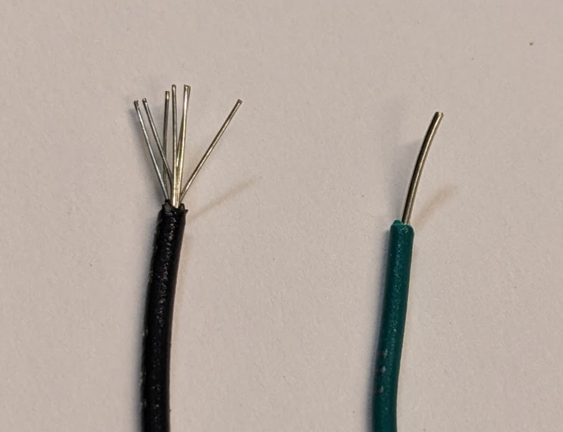
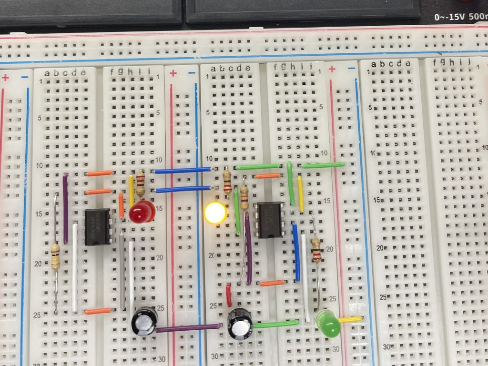
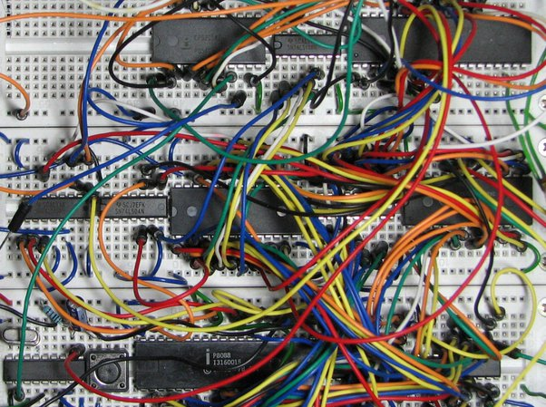
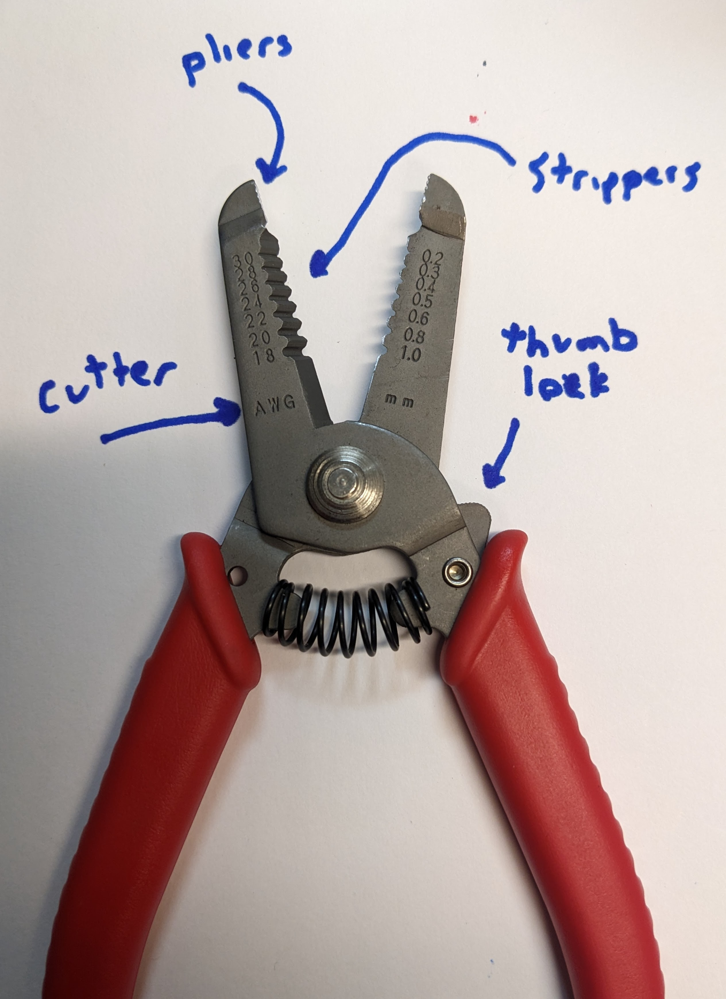
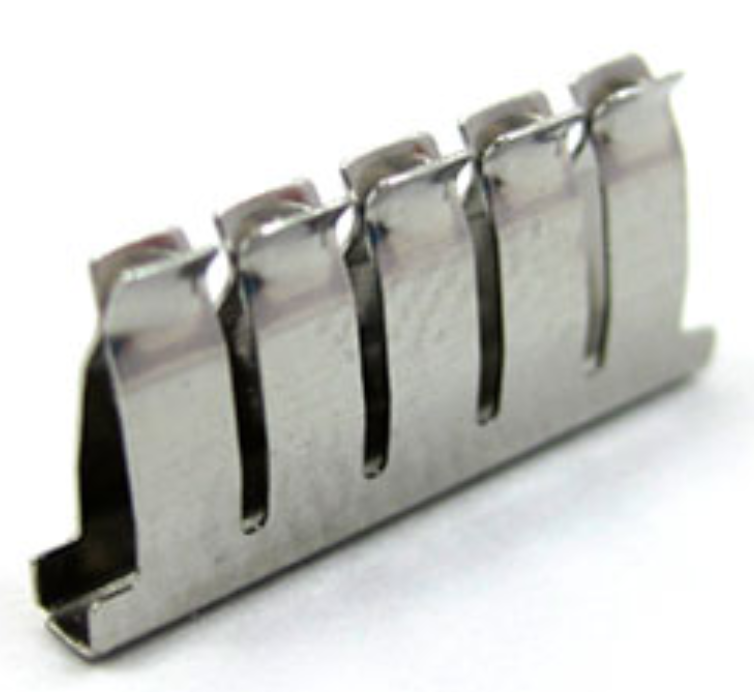
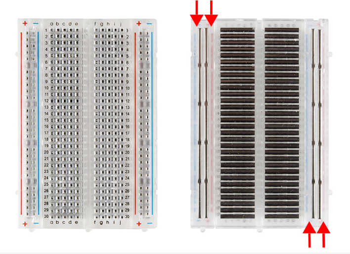
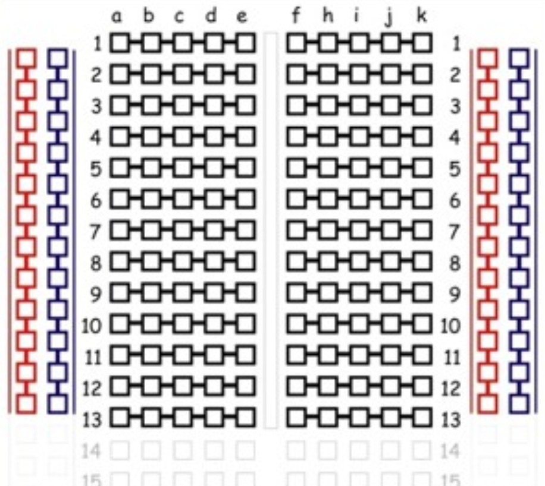

# Electronics Prototpying

Building a circuit begins with a functional description of the circuit. Then, a circuit diagram is drawn, showing the connections between components and component values. Only then should you physically build the circuit, a little bit at a time, testing as you go. These steps will help prevent large errors or bugs in your design. If you go straight to construction without defining the problem or drawing a circuit diagram, or building everything at once without testing, you will end up spending a large amount of time debugging. So build the debugging into your design process and have a more enjoyable experience!

# Physically building a circuit

Circuits are build by connecting components with wire. While prototyping, wires should be plugged into removable connections until the circuit is tested and working. Later the circuit can be transfered to a permanent board and soldered, or a printed circuit board (PCB) can be designed and manufactured for a custom solution.

## Wire

There are two main types of wire, solid core and stranded, each covered with a jacket of insulation. Solid core wire has a single, thick strand of wire, while stranded wire has many strands of thinner wire twised together. Stranded wire is flexible: bend the wire and it should return to the original shape. Solid core wire will stay bent, like a bending a paper clip. Typically stranded wire is used for long, dangling wires or build a cord. But stranded wire is usually inconvinient for general prototyping, the strands fray and can touch components that they should not, potentially causing shorts. Solid core wire works much better with the removable connections used when prototyping.

Wire kits are available from electronics distributors, either pre stripped and bent or with hard solid tips. Your kit contains a wrap of several colors of solid core wire, and a wire cutting and stripping tool. In this way you can make wires of any length and color. For debugging purposes, convention typically has ground connections built with black wire and power connections with red wire. This will make it easier to look at a board later and identify which wires do what. It is also convention to keep wires flush against the board to prevent them from getting caught and uplugged when transferring in and out of your bag, and manhattan style wires (bends at 90 dgrees) to keep things organized.

## Wire strippers
Wire comes in a specific gauge, with smaller numbers representing thicker wires that can supply more current without heating up. Typical prototyping wires are 22, 24, or 26 gauge. The wire stripping tool has alligator like teeth for removing insulation. Use the correct gauge tooth for your wire, which may take some trial and error to identify depending on the manufacturing tolerances of your tool. Too large a tooth gap and the insulation will not be cut all the way, making it difficult to pull off. Too small a tooth gap and the insulation will be cut away, but the wire will also be nicked and is much more likely to break there, typically in such a way that requires tweezers to get out of whereever it was stuck. Identify the gauge of the tool that works best for your wire, the insulation should slide right off without too much pulling without nicking the wire.

## Breadboading

Wire must touch to conduct. The tool most commonly used in electronics prototyping to connect wires is a breadboard, a collection of spring like wires in a plastic housing, with holes organized for the most convinient connections.

The breadboard has two sides, each with two columns of conductors, called rails. The rails are used to distribute power, like 3.3V and ground, up and down the length of the breadboard, since these are the most commonly needed connections. The center of the breadboard arranges the conductors in rows, with 5 holes on each side, broken in the middle.

The break in the middle of the breadboard is designed to allow integrated circuits or breakout boards to span the gap and make connections on either side.

# Soldering

Soldering is a more permanent connection between conductors, and is ocassionally necessary while prototyping to make connections to unique components.

[Soldering GIFs](http://hades.mech.northwestern.edu/index.php/EDI_Bootcamp)

# Build a simple circuit

Follow along with the Build a Simple Circuit page to practice your breadboarding and wire making skills.
