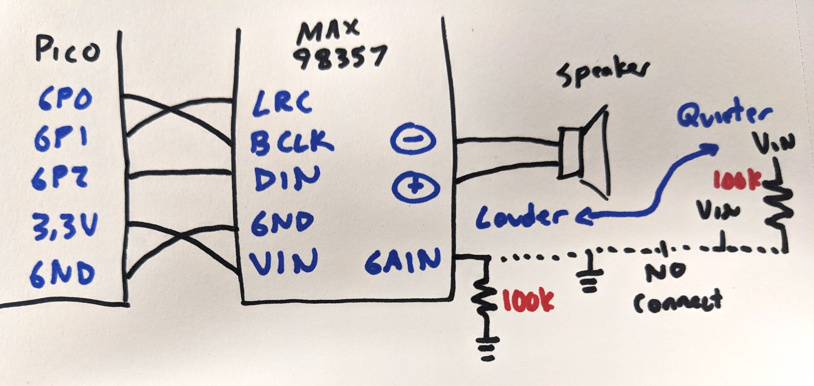

# Programming the Pico in Circuit Python

The Raspberry Pi Pico microcontroller breakout board is a powerful and inexpensive device that can be programmed in Circuit Python or in C. On this page, we will program it with Cicruit Python.

When the Pico is plugged into a computer for the first time it will enumerate as a thumb drive called RPI-RP2. This is the default, blank configuration of the board. The board can be placed into this mode while holding the BOOT button while plugging the USB cable in. 

To install Circuit Python, download a precompiled version from the [Circuit Python website](https://circuitpython.org/board/raspberry_pi_pico_w/). Copy the file with a .uf2 extension onto the RPI-RP2 drive. The drive will dissappear and then reappear as a new thumb drive called CIRCUITPY. On this drive is a file called code.py, a folder called lib, and two other text files.

To edit the code, open code.py in a text editor, edit the file, and after clicking save, the new file will start to run. The board will also enumerate as a virtual serial port, and the port can be opened in a terminal emulation program to send and recieve data.

After the code is saved, it will remain on the board forever. Unplug the USB and plug in a battery and the code will immediately begin running again! The code doesn't really end either, typically the code will loop forever, until power is removed.

It can be annoying to use a general text editor and terminal emulator program, so instead you could use an IDE developed for Circuit Python called [Mu](https://codewith.mu/), pronounced "moo". Mu contains a text editor, a terminal emulator, and some other goodies like standard Python and pygame zero for graphics.

After you open Mu, click the Mode button in the top right and switch to CircuitPython. Click the load button and open code.py in the CIRCUITPY drive. One downside to the design of the Circuit Python system si that the code that runs on the board must be named code.py. If there is no file called code.py then nothing will run, and putting another .py file in the drive will be ignored unless it is run as a function from code.py. Not a horrible problem, but annoying when you have a few different programs to try out and you must constantly rename them.

## REPL

Before editing code.py we can interact with Circuit Python using Read-Evaluate-Print-Loop, or REPL mode. Press the Serial button and click inside the CircuitPython REPL window at the bottom of the screen. Type any key and the board will enter REPL mode and present three carrots, ">>>". This is your clue to interact directly with Python. 

In REPL mode you can create variables, do math or loops, and test code snippets. You wouldn't want to work in REPL, it is too slow, saving code in a file is much more convinient, but REPL is useful for debugging.

To exit REPL and run code.py, type CTRL-D. If the code ends, the Serial window will prompt you to type any key to enter REPL or type CTRL-D to run the code again. Usually the code is in an infinite loop and will not end, so to cause the code to end and enter REPL at any time you can type CTRL-C. This is the best way to stop and restart the code.

## Try some code!

### Hello World!
```py
{{#include print_hello.py}}
```

### Blink an LED


```py
{{#include blink.py}}
```

### Change LED brightness with PWM
Pulse width modulation, or PWM, blinks a pin at a frequency so fast that your eye smooths out the blinking, and the duty cycle sets how bright the LED appears to be.

All GPIO pins can generate PWM, but there are only 16 PWM channels, so you cannot assign two independent PWM pins to the same channel. The channels are shown in the following table from the RP2040 datasheet:


For example, you can use PWM on GP13 and GP14, but not GP14 and GP15.

```py
{{#include fade.py}}
```

### Read a push button

```py
{{#include read_button.py}}
```

### Button Debounce
The voltage from a button press can toggle very quickly with one button press. The "bounces" can be ignored by reading the button after detecting a press and making sure the button is still pressed a short time later.

```py
{{#include debounce.py}}
```

### Read an analog voltage
The analog to digital converter, or ADC, converts 0-3.3V to digital values from 0-65535. 

```py
{{#include read_voltage.py}}
```

### Set the angle of an RC servo motor
An RC servo motor is a position controlled device. The cable requires 4-6V on the red wire, ground on the brown wire, and a digital signal on the orange wire. The digital siganl is a pulse, 0.5 ms to command 0 degrees to 2.5 ms to command 180 degrees, every 20 ms. This can be acheived with PWM.

```py
{{#include servo.py}}
```

### Set the color of an addressable RGB LED (neopixel or ws2812b)
LEDs can be PWMed to change their brightness, and you can use combined red/green/blue LEDs in a single package to make any color, but each LED would require 3 PWM pins. You just don't have enough pins to control a lot of LEDs.
How many is a lot? Maybe you want hundreds of LEDs. You can do this with "smart" LEDs like the ws2812b, also known as neopixels. Each LED color and brightness can be set individually with just one pin from the microcontroller.
The following method is a very simple way to set the color of a neopixel. Later you'll see a method that uses an external library and allows for more high level control of the LED colors, but this method is included in the default version of Circuit Python. How can you find these included functions? In REPL mode, type import [tab key], all the available methods will be printed.

```py
{{#include neopixel_write.py}}
```

## Code with external libraries
Most components that you connect to your board with a circuit do not have code included with Circuit Python. The library must be downloaded and copied to the CIRCUITPY/lib folder to work. There isn't enough space on the board for all of the libraries, only copy the libraries you need!

The libraries come as a zip folder from [Circuit Python](https://circuitpython.org/libraries). Download the folder that corresponds to your version of Circuit Python and unzip the folder. Libraries are found in the library bundle /lib folder, sometimes as files with .mpy extensions or as entire folders. Copy the files needed into the CIRCUITPY/lib folder. Note the Pico W has only 2Mbyte of space, so copy only the files you need. Example code is found in the library bundle /examples folder, the contents of these files can be copied into code.py. Remeber that the code that runs on your board is code.py, so you can't just copy an example .py file, it must be named code.py!

### Advanced neopixel control
Find the neopixel.mpy file in the library bundle and copy it to CIRCUITPY/lib. 

The function

```py
pixels = neopixel.NeoPixel()
```

creates a structure that allows access the color of each LED in the Neopixel strip. For example, the first Neopixel is at index 0:

```py
pixels[0] = (255,0,0) # set the first LED full red
```

Nothing happens at that moment. All of the Neopixels update simultaneously when you call the show function

```py
pixels.show()
```

```py
{{#include neopixel.py}}
```

The following code sets each Neopixel to the same brightness according to a color on the color wheel, so the input is a single number from 0 to 360 and the output is in RGB, starting at red. This is a useful function because the brightness is constant and it takes only one input.

```py
{{#include neopixel_rainbow.py}}
```

### Read an accelerometer
An accelerometer reports the acceleration of the board along the X, Y and Z axes. Acceleration is measured in Gs. At rest with Z pointed up, X and Y will report 0 G and Z will report -1 G. Sometimes the data is an integer and you must convert to Gs knowing the sensitivity and resolution of the accelerometer.

```py
{{#include mma8451.py}}
```

### Read an IMU
An intertial measurement unit reports at least acceleration and angular velocity, and sometimes also magnetic field strength and barometric pressure. All of this raw data can be integrated to estimate position and orientation, although the algorithm can be tricky and the sensor needs to be low noise, low offset and low drift. 

```py
{{#include mpu6050_imu.py}}
```

### Play a sound
Humans can hear sounds from 20Hz to 20kHz. Sound is made by applying a varying signal to an amplifier to a speaker, sometimes as a voltage and sometimes digitally. The update rate effects the quality of the sound, and is required mathematically to be at least 2 times the highest frequency contained in the sample. But that means a lot of data needs to be stored and sent to the amplifier, so in microcontroller projects the quality is usually dropped in order to take up less space and computational time. 

Here a digital amplifier is used, the MAX98357, using a digital protocol called I2S. Digital transmission is nice because it helps to reject analog noise. 

The following code plays a tone by making a sine wave with a specific frequency in an array. This type of sound is sometimes refered to as 8bit sound, although the data is actually 16bit in this case, and might remind you of "early Nintendo level" of sounds.

```py
{{#include play_tone.py}}
```

You can also play a sound file, in .wav format. A .wav file has no compression, it is just a giant array of the signal recorded at a set frequency. Note the limited space on your microcontroller board, the Pico W has only 2Mbyte total, so you are limited in how long of a .wav file you can play. There are lots of sound editing softwares available to convert other file types into .wav, as well as downsample to lower frequencies to make the file smaller (try Audacity).

```py
{{#include play_wav.py}}
```

### Read from a capacitive touch sensor
Physical buttons have limitations in certain environments, and such as places that are dirty or wet. A "contactless" button can be made by reading the change in capacitance on a conductor when a user gets close to the surface. In this way the conductor can be placed behind a barrier and still detect presence. The downside to this technique is a lack of feedback in the form of a change in the force profile, like a detent, or an audible click, when the button is selected. The cool thing is that many nontraditional button materials can be used, as long as they a conductive (see bananna piano).

```py
{{#include mpr121_cap_touch.py}}
```

### Read from a temperature and barometric sensor
The BMP180/BMP280 sensor returns temperature and air pressure measurements. The BMP180 resolution is not as good as the BMP280, but is otherwise the same. Barometric pressure can be used to estimate altitude or change in height, like going high up in a building.

```py
{{#include bmp180_temperature_pressure.py}}
```

### Read from an ultrasonic rangefinder
A classic way to estimate distance is to emit a pulse of sound and time how long it takes for an echo to return. The sound is usually at 40kHz or above, outside the range of human hearing. Sound travels at 343m/s, so the distance can be calculated as the time, divided by two, times the speed of sound.

The HC-SR04 ultrasonic rangefinder is inexpensive, but works better with a 5V supply rather than the usual 3.3V, sometimes misses the echo or returns values with high amounts of noise, and has a wide view angle, so sometimes returns the distance of objects not exactly right in front of the sensor.

```py
{{#include hcsr04_rangefinder.py}}
```

### Read from a laser proximity, gesture and light sensor
A more modern rangefinder uses the light reflected from a laser emitter, either from the ammount reflected or coherence. These sensors often can report other values, like ambient light conditions or gestures from waving in front of the sensor.

```py
{{#include adps9930_proximity.py}}
```

### Draw text to an I2C OLED monochrome display
OLED displays have very high contrast, with an LED for each pixel. Displays take a lot of memory and work best with SPI communication, but a small monochrome display can work with I2C which makes the wiring more convinient. 

```py
{{#include draw_text_ssd1306.py}}
```

### Draw an eye on a round TFT LCD
The GC9A01 is a driver for a 1.28 inch round TFT LCD display, controlled with SPI in 16bit color. The library is located in the Circuit Python Community Bundle, not the regular Library Bundle.

```py
{{#include draw_eye_gc9a01.py}}
```

### Read distance from an ultrasonic rangefinder
The HC-SR04 ultrasonic rangefinder emitts several pings at frequencies above the range of human hearing (20kHz). The sensor listens for the echo of the sound. The time it takes for the sound to return can be converted to distance using the speed of sound in air. Here the library takes care of sending a pulse to the TRIG pin and timing how long the ECHO pin is high. Ocassionally the echo will not come back, so a try: exception: case is used to detect when there is no data.

```py
{{#include read_ultrasonic_hcsr04.py}}
```