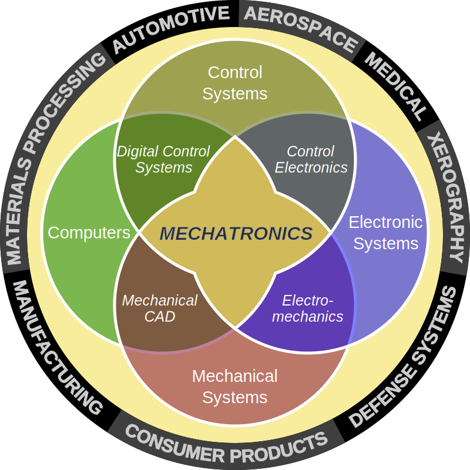

# What is Mechatronics?

Mechatronics is an engineering discipline at the intersection of Mechanical Engineering, Electrical Engineering, Computer Science, and Control Theory.  

Mechatronics engineers use mechanical and electrical specifications to select sensors and actuators, and interface them using embedded controllers programmed with algorithms for their control.  

Many of today's "smart" devices are mechatronic. These can be found in consumer electronics, IoT, medical devices, manufacturing, automation, automotive, just about every industry you can think of!  

Common problems considered in a mechatronic project include:
* how to make something move? how much speed and torque are required?
* how to drive the actuator? how much voltage and current are required?
* how to sense the world? what sensitivity, accuracy, and sampling rate are required?
* what type of controller to use? how much memory is needed? how much computational speed is needed?
* how do I implement my control? what programming language do I use? what is the structure of the code?

These questions are addressed in this website!